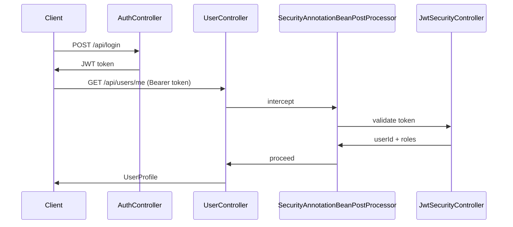

# Example 03: Spring Boot REST API with JWT

## What this demonstrates

- **rest-security-spring** with `@Security` and `@Public` on controller methods.
- Spring Boot 3.x REST controllers; JWT-based auth (no database; roles from claims).
- `SecurityAnnotationBeanPostProcessor` wraps beans that implement interfaces; first parameter is `SecuredRequestContext` (resolved from `Authorization: Bearer <token>`).
- Optional **audit listener** bean for success/failure logging.
- Health endpoint marked `@Public` (no auth).

## How to run

From the project root, install the library, then:

```bash
cd examples/03-spring-boot-jwt
mvn spring-boot:run
```

Server starts at http://localhost:8080.

## Try it

```bash
# Health (no auth)
curl -s http://localhost:8080/api/health

# Login
TOKEN=$(curl -s -X POST http://localhost:8080/api/login -H "Content-Type: application/json" -d '{"username":"alice","password":"x"}' | jq -r .token)

# Profile (requires USER)
curl -s http://localhost:8080/api/users/me -H "Authorization: Bearer $TOKEN"

# Admin (requires ADMIN; use username admin)
TOKEN=$(curl -s -X POST http://localhost:8080/api/login -H "Content-Type: application/json" -d '{"username":"admin","password":"x"}' | jq -r .token)
curl -s -X DELETE http://localhost:8080/api/admin/users/bob -H "Authorization: Bearer $TOKEN"
```

## Key code

**Config: BPP + JWT controller + argument resolver**

```java
@Bean
public JwtSecurityController jwtSecurityController() {
    return new JwtSecurityController(JwtConfig.withSecret(HMAC_SECRET));
}
@Bean
public SecurityAnnotationBeanPostProcessor securityAnnotationBeanPostProcessor(JwtSecurityController jwt) {
    return new SecurityAnnotationBeanPostProcessor(jwt, jwt);
}
// addArgumentResolvers: SecuredRequestContextArgumentResolver (Bearer token → SecuredRequest)
```

**Controller implements interface; first param is SecuredRequestContext**

```java
public interface UserApi {
    @Security(roles = {"USER"})
    UserProfile getProfile(SecuredRequestContext request);
}
@RestController
public class UserController implements UserApi {
    @GetMapping("/me")
    public UserProfile getProfile(SecuredRequestContext request) {
        return new UserProfile(SecurityContextHolder.getContext().userId(), ...);
    }
}
```

**@Public skips security**

```java
@Security(roles = {"USER"})
public interface HealthApi {
    @Public
    Map<String, String> health();
}
```

## Architecture



## Sample users

| Username | Roles        |
|----------|--------------|
| alice    | USER         |
| bob      | USER, EDITOR |
| admin    | ADMIN        |
