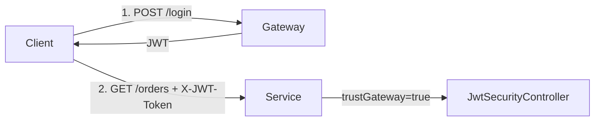

# Example 05: Microservice behind gateway (trust-gateway mode)

## What this demonstrates

- **trustGateway=true**: the service does not verify the JWT signature; the gateway already authenticated the user and signed the token.
- Docker Compose: mock gateway (signs JWTs) and microservice (trusts them).
- Zero-infrastructure on the service: no session store, no user DB, no signature verification.
- Realistic for microservices where the edge validates tokens and passes them to internal services.

## How to run

**Prerequisite:** From the rest-security project root run `mvn install -DskipTests`.

### Option A: Without Docker (recommended)

**Terminal 1 – Gateway:**
```bash
cd examples/05-gateway-microservice/gateway
mvn exec:java
```

**Terminal 2 – Service:**
```bash
cd examples/05-gateway-microservice/service
mvn exec:java
```

Gateway: http://localhost:8080  
Service: http://localhost:8081  

### Option B: With Docker

From the **rest-security project root** (so the service build can use the installed artifacts via a mounted .m2 or pre-installed image), you can build and run. If the service image build fails to resolve `com.posadskiy:rest-security-*`, run Option A instead.

```bash
cd examples/05-gateway-microservice
docker-compose up --build
```

## Try it

```bash
# 1. Get token from gateway
TOKEN=$(curl -s -X POST http://localhost:8080/login -H "Content-Type: application/json" -d '{"username":"alice","password":"x"}' | jq -r .token)

# 2. Call service with token (service trusts gateway; no signature check)
curl -s http://localhost:8081/orders -H "X-JWT-Token: $TOKEN"

# 3. Admin endpoint (use username admin to get a token with ADMIN role)
TOKEN=$(curl -s -X POST http://localhost:8080/login -H "Content-Type: application/json" -d '{"username":"admin","password":"x"}' | jq -r .token)
curl -s http://localhost:8081/admin/stats -H "X-JWT-Token: $TOKEN"
```

## Key code (service)

**Trust gateway — no signature verification:**

```java
JwtConfig config = JwtConfig.withSecretTrustGateway("unused-secret-not-verified");
JwtSecurityController jwt = new JwtSecurityController(config);
SecurityEnforcer enforcer = new SecurityEnforcer(jwt, jwt);
```

**Token from header (gateway sets it):**

```java
String token = ctx.header("X-JWT-Token");
enforcer.enforceAndCall(new SecuredRequest(token), new String[]{"USER"}, () ->
    getOrders(SecurityContextHolder.getContext().userId()));
```

## Architecture



The gateway signs the JWT; the service only parses claims (user, roles) and does not verify the signature.
